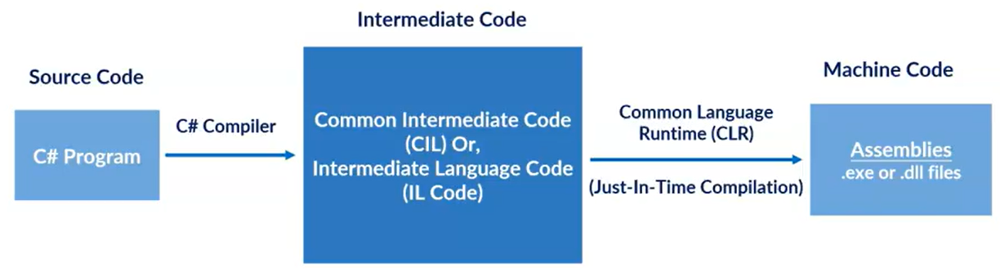
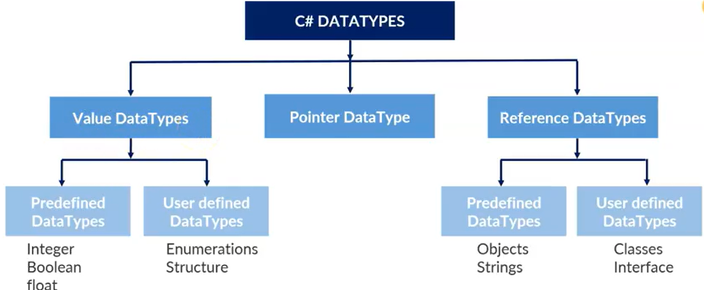

# Introduction to C#
- An object-oriented programming language developed by Microsoft.
- It basically runs on .NET Framework.
- C# is approved as a standard by ECMA and ISO.
- C# is designed for CLI (Common Language Infrastracture)
- It has a huge community support.
- C# is udes to develop we apps, descktop apps, mobile apps, games and much more.

## Features Of C#
- Simple
- Fast Speed
- Object-Oriented
- Type Safe
- Interoperability
- Scalable
- Rich Library
- Modern Programming Language

# C# Code Execution



# Variable and DataType

**Variables**
- A variable is a names storage location in computer memory that holds a value
- Variables are used tostore and manipulate data in a program.
- In C#, all the variables must be declared before they can be used.
- It is basic unit of storage in a program.
- Tha value stored in a variable can be changed during program execution.
- Syntax:
`<data type> <variable name> = <value>;`

**Types Of Variables**
- Local Variables
- Instance or Non-Static Variables
- Static or Class Variables
- Constant Variables
- ReadOnly Variables

**Data Types**
- Data types specify the type of data that a valid C# variable can hold.
- C# is a strongly-typed language.
- It means we must declare the type of variable that indicates the kind of value it is going to store, such as integer, float, decimal, text, etc.
- The following declares and initialized variables of different data types.

```
string stringVar = "Hello World!!";
int intVar = 100;
float floatVar = 10.2f;
char charVar = 'A';
bool boolVar = true;
```



# Operators and Operators Precedence

**Operators:**
- Operators are synbols that are used to perform operataions on operands.
- Operands may be variables and/or constants
- Operators are used to manipulate variables and values in a program.
- C# supports a number of operators that are classified based on type of operations they perform.

**Types Of Operators**
- *Unary Operator*
++, --
- *Binary Operators*
Arithmetic: +, -, *, /, % 
Relational: <, <=, >, >=, ==, !=
Logical: &&, ||, !
Bitwise: &, |, <<, >>, -, ^
Assignment: =, +=, -=, *=, %=
- *Ternary Operator*
Ternary Or Conditional: ?:

# Conditional Statements
- Conditional statements are based on certain conditions and generate decisions accordingly.
- These statements are a bunch of codes that can be executed by "decisions statements".
- These conditions have some specific "boolean espressions".
- The boolean expression of these statements generated "Boolean Value" which could be either true of false

**Types of Conditional Statements**
- If Statement
- If-Else Statement
- If-Else_If or ladder Statement
- Switch


# Loops
- Loops are used to execute a block of a code repeatedly until a certain condition is met.
- Used to repeat a block of statements for certain times.
- A loop statement continue its execution until the specified expression evaluates to false.

**Types of Loop Statements:**
- While
- Do-While
- For
- Foreach

# Jump Statements
- Jump Statements are keywords that allows you to control the flow of execution in a program.
- These are used to transfer program control from one point to another point in the program.

There are five keywords in Jump Statemets:
- break
- continue
- goto
- return
- throw

# Array and Types of Arrays
- A collection of elements of same data type that are stored in contiguous memory locations.
- Each element in an array is identified by its index or position within the array, starting from 0.
- Arrays are declared using square brackets "[]" after the type name, followed by the array name.
- For example, to declare and initialize an array named myArray that holds 5 integers, you can use the following code:
`int[] myArray = new int[5];`

**Advantages of Arrays**
1. Code Optimization (less code)
2. Random Access
3. Easy to treverse data
4. Easy to manipulate data
5. Easy to sort data

**Arrays:**
- Single-dimensional Array
- Multi-dimensional Array
- Jagged Array

**One-Dimensional Array**
- It is simplest type of array that contains only one row for storing data.
- It has single set of square  bracket ("[]").
- To declare single dimensional array in C#, you can write the following code.
- For example, to declare an array of integers names "age" that can hold 5 elements in a single row, you would write:
```
//declare an array
int[] age;

//allocate memory for array
age = new int[5];
```

**Multi-Dimensional Array**
- This Array contains more than one row to store data on it.
- Also known as rectangular array because it has the same length of each row.
- It can be two-dimensional array or three-dimensional array or more.
- Contains more than one comma (,) within single rectangular brackets ("[,,,]").
- To storing and accessing the elements from a multidimensional array, you need to use a nested loop in the program.
- Example:
```
int[,] s = new int [3, 3];
```

**Jagged Array**
- A jagged array is an array of arrays, where each sub-array can have a different length.
- Jagged array are useful when you need to store a collection of arrays of different sizes.
- For example, to declare and initialize a jagged array named myArray that contains 3 sub-arrays of integers with different lengths, you can use the following code:
```
int[][] myArray = new int[3][]
myArray[0] = new int[2] {1, 2};
myArray[1] = new int[3] {3, 4, 5};
myArray[2] = new int[4] {6, 7, 8, 9};
```

# String and String Method
- String is an object of System.String class that represent sequence of characters.
- For example, "hello" is a string containing a sequence of characters 'h', 'e', 'l', 'l' and 'o'.
- We can perform many operations od strings such as concatenation, comparison, getting substring, search, trim, replacement etc.
- In C#, string is a keyword which is an alias for System,String class.
- That is why string and String are equivalent. We are free to use any nameing convention.
```
string s1 = "hllo"; //creating string using string keyword
String s2 = "welcome"; //creating string using String class
```

**Types of String**
- Immutable String (System.String class)
- Mutable String (String Builder class)
Mutable Strings are Modifiable while Immutable Strings can't be modified.

**String Methods**
- **Clone** - Make clone of strings.
- **CompareTo()** - Compare two strings and returns integer value as output.
- **Contains()** - It checks whether specified character exists or not in the string value.
- **EndsWith()** - Checks if the string ends with the given string.
- **Equals()** - Compares two strings and returns boolean value as output.
- **ToUpper()** - Converts the string to uppercase
- **ToLower()** - Converts the string to lowercase
- **Insert()** - Insert a string or character in the string at the specified position.
- **IndexOf()** - Returns the index position of first occurrence of specified character.


# Object-Oriented Programming Concepts

**What is Object-Oriented Programming?**
- OPPs stands for Object-Oriented Programming (OOP) concepts.
- C# is an object-oriented programming language that supports the OOP paradigm.
- Object Oriented Concepts provides a clear modular structure of programs.
- This makes easy to maintain the existing code.
- Codes can be reused without any redundency.
- The main aim of OOP is to bind together the data the functions that operate on them so that no other part of the code can access this data except that function.

**Object-Oriented Concepts**
- Classes
- Objects
- Encapsulation
- Abstraction
- Inheritance
- Polymorphism

# Classes and Objects

**Classes**
- A class is a blueprint or a template for creating objects.
- It defines the properties and behavior of an object.
- A class can have fields, properties, methods, and events.
- They collectively define the data and behaviour of an object.
- In object creating, class gets its own set of data and behavior based on properties and methods defined in the class.
- Syntax:
```
AccessSpecifier class NameOfClass
{
    //Member variables
    //Member functions
}
```

**Objects**
- An object is dynamically created instance of the class.
- It is created at runtime so it can also be called a runtime entity.
- All the members of the class can be accessed using the object.
- The object definition starts with the class name followed by the object name.
- Then the new operator is used to create the object.
- Syntax:
```
NameOfClass NameOfObject = new NameOfClass();
```

# Encapsulation

- Encapsulation is defined as the wrapping up of data under a single unit.
- It is he mechanism that binds together code and the data it manipulates.
- In a different way, encapsulation is a protective shield that prevents the data from being accessed by the code outside this shiels.
- In encapsulation, data is a class is hidden from other classes, so it is also known as data-hiding.
- Encapsulation can be achived by: Declaring all the variables in the class as private.

# Abstraction
- Data Abstraction is the property by virtue of which only essential details are exhibited to user.
- Abstraction can be achived  with either abstract classes or interfaces.
- The abstract keyword is used for classes and methods:
    - Abstract class:
        - It is a restricted class that cannot be used to create objects (to access it, it must be inherited from other class).
    - Abstract method:
        - It can only be used in an abstract class, and it does not have a body.
        - The body is provided by the derived class (inherited form).

*For Example: * Consider a real-life scenario of withdrawing money from ATM.
- The user only knows that in ATM machine first enter ATM card.
- then enter the pin code of ATM card,
- and then enter amount which he/she wants to withdraw and at last, he/she gets their money.
- The user does not know about the inner mechanism of the ATM of withdrawing money etc.

**Access Modifiers**
- Access modifiers or specifiers are the keywords.
- They are udes to specify acceddibility or scope of variables and dunctions in the C# application.
- We can choose any of these to pretect our data.
- Public is not restricted and Private is most restricted.

Types Of Access Modifiers:
- public
- private
- protected
- internal
- protected internal

- **Public** - It specifies that access is not restricted.
- **Protected** - It specified that access is limited to the containing class or in derived class.
- **Internal** - It specifies that access is limited to the current assembly.
- **Protected Internal** - It specifies that access is limied to the current assembly or types derived from the containing class.
- **Private** - It specifies that access is limited to the containing type.

# Constructors
- A constructor is a special method that is used to initialize an object of a class
- It is similar to a method that is invoked when an object of the class is created.
- However, unlike methods, a constructor:
    - has the same name as that of the class
    - does not have any return type

**Types Of Constructors**
- **Default** - A constructor with no parameters is called a default constructor.
- **Parameterized** - This constructor can also accept parameters.
- **Copy** - We use a copy constructor to create an object by copying data from another object.
- **Private** - Once constructor is private, we cannot create object of class in other classes
- **Static** - This constructor is initializes static fields or data of the class to be executed only once.

**Constructor Overloading**
- It allows you to define multiple constructors for a class, each with a different set of parameters.
- This allows you to create objects of the class with different initial states, depending on the arguments passed to the constructor.
- It also allows you to make your code flexible and reusable.


# Inheritance
- In C#, it is possible to inherit fields and methods from one class to another.
- It allows us to define a new class based on an existing class.
- The new class inherits the properties and methods of the existing class and can add new properties and methods of its own.
- It promotes code reuse, simplifies code maintenance, and improves code organization.

**Types Of Inheritance**
- Hierarchical Inheritance
- Single Inheritance
- Multilevel Inheritance
- Multiple Inheritance
- Hybrid Inheritance

