# Resolveing Merge Conflicts
- Merge conflicts occur when a person needs to make a decision.
- Merge conflicts can only occur if the same file is changed.
- Git automatically merges changes to different parts (hunks) of files.

**Avoiding Merge Conflicts**
- Git merges are usually quite easy
- Small, frequenr merges are the easiest

**Resolving a merge conflict**
Involves three commits:
1. The tip of the current branch - "ours" or "mine"
2. The tip of the branch to be merged - "theirs"
3. A common ancestor - "merge base"

**Basic steps to resolve a merge conflict**
1. Checkout master
2. Merge featureX
    a. CONFLICT - Both modified fileA.txt
3. Fix fileA.txt
4. Stage fileA.txt
5. Commit the merge commit
6. Delete the featureX branch label

When attempting a merge, files with conflicts are modified by Git and placed in the working tree

**Merge Conflict**
```
$ git log --oneline --graph --all
* c1633f9 (HEAD -> master) added feature 3
| * 942b91e (feature2) added feature 2
|/
* c431e4b added feature 1
$ git merge feature2
Auto-merging fileA.txt
CONFLICT (content): ....
$ git status
On branch master
You have unmerged paths.
...
```

**Conflicted Hunks**
Conflicted hunks are surrounded by conflict marker <<<<<<< and >>>>>>>

```
fileA.txt
feature 1
<<<<<<< HEAD
feature 3
=======
feature 2
>>>>>>> feature2
```

**Reading Conflict Markers**
- Text from the HEAD commit is between <<<<<<< and =======
- Text from the branch to be merged is between ======= and >>>>>>>

**Fix and Commit the Merge**
```
$ cat fileA.txt
feature 1
feature 2
feature 3
$ git add fileA.txt
$ git commit
$ git log --oneline --graph --all
$ git branch -d feature2
```

**REVIEW**
- Merge conflicts occur when two branches modify the same hunk
- When a conflict occurs:
    - Git will create files in the working tree containing conflict markers
    - Fix, add and commit the conflicted files


# Tracking Branches
A local branch that represents a remote branch
`<remote>/<branch>`

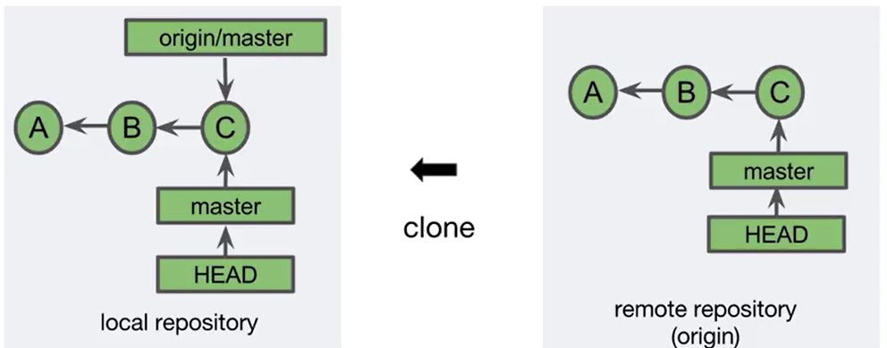

Tracking branches - related but decoupled

**Viewing Tracking Branch Names**
`git branch --all`
Displays local and tracking branch names

```
$ git clone https://...
$ cd projecte
$ git branch
* master
$ git branch --all
* master
  remotes/origin/HEAD -> origin/master
  remotes origin/master
```

**remotes/origin/HEAD**
Specifies the default remote tracking branch
- Allows `<remote>` to be specified of `<remote>/<branch>` in Git commands
```
$ git branch --all
* master
  remotes/origin/HEAD -> origin/master
  remotes/origin/master
$ git log origin/master --oneline
215b50a (origin/master, origin/HEAD) add feature 1
f92ad48 (HEAD -> master) add fileA.txt
$ git log origin --oneline
215b50a (origin/master, origin/HEAD) add feature 1
f92ad48 (HEAD -> master) add fileA.txt
```

**Changing remotes/origin/HEAD**
Change the default remote tracking branch with
`git remote set-head <remote> <branch>`

```
$ git branch --all
* develop
  master
  remotes/origin/HEAD -> origin/master
  remotes/origin/develop
  remotes/origin/master
$ git remote set-head origin develop
$ git branch --all
* develop
  master
  remotes/origin/HEAD -> origin/develop
  remotes/origin/develop
  remotes/origin/master
```

**Viewing Tracking Branch Status**
`git status` includes tracking branch status
```
$ git status
On branch master
Your branch is up-to-date with 'origin/master'
...
```

`git status` will inform you if the cached tracking branch information is out of synch with your local branch
```
$ git commit -m "added feature 2"
$ git status
Your branch is ahead of 'origin/master' by 1 commit.
...
```

**Viewing Commits of All loacl and Trach=king branches**
Use `git log --all` to see a combined log  of all local and tracking branches
```
(edit fileA.txt)
$  git add fileA.txt
$ git commit -m "added feature 2"
$ git log --all --oneline --graph
```

**REVIEW**
- Local branches that represent remote branches
- Named `<remote/branch>`, for example `origin/master`
- Can become out of synch with local branches
- Updated with network command like **clone, fetch, pull** and **push**

# Fetch, Pull, and Push

**Nework Commands**
**Clone** - Copies a remote repository
**Fetch** - Retrieves new object and references from the remote repository
**Pull** - Fetches and merges commits locally
**Push** - Adds new objects and references to the remote repository

**Fetch**
`git fetch <repository>`
- Retrieves new objects and references from another repository
- Tracking branches are updated
```
$ git log origin/master --oneline --graph --all
$ git fetch
$ git log origin/master --oneline --graph --all
```

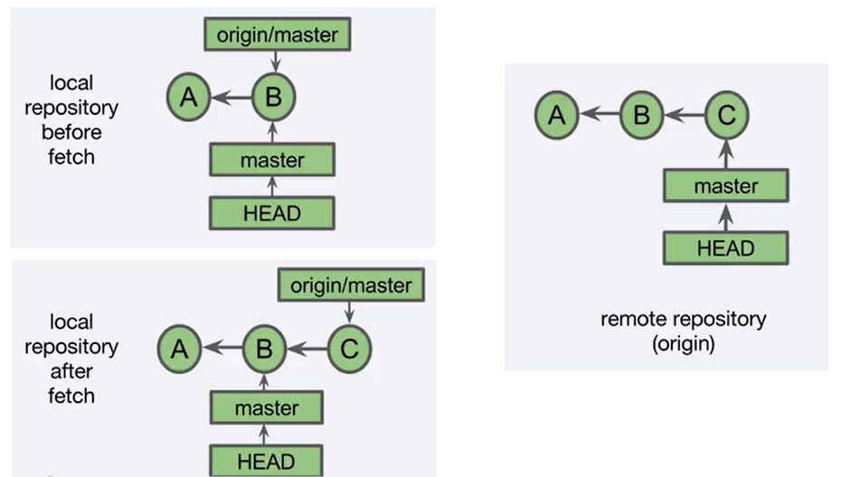

After `git fetch`
`git status` will inform you that current branch is behind the tracking branch

```
$ git fetch
$ git status
```

**Pull**
`git pull [<repository>] [<branch>]`
Combines `git fetch` and `git merge FETCH_HEAD`
- If objects are fetched, the tracking branch is merged into the current local branch
- This is similar to a topic branch merging into a base branch
```
$ git pull
```

`git pull` merging options
`--ff` (default) - fast-forward if possible, otherwise perform a merge commit
`--no-ff` - always include a merge commit
`--ff-only` - cancel instead of doing a merge commit
`--rebase [--preserve-merges]` 

Pull with a Fast-Forward merge

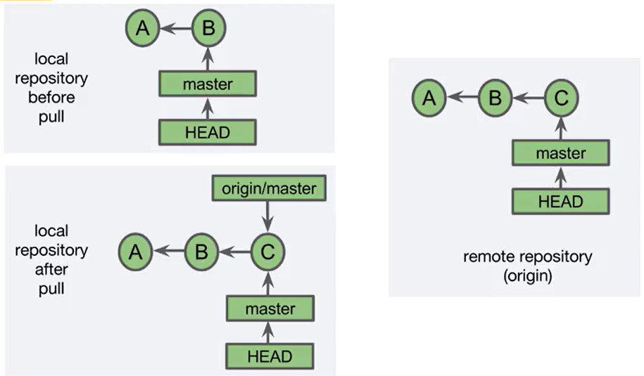

```
$ git status
$ git pull
$ git log --oneline
```

Pull with a merge commit

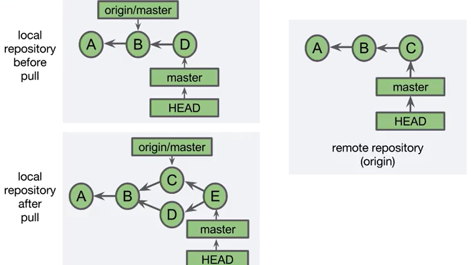

`git pull` with conflicting uncommitted changes
```
$ echo "feature4" >> fileA.txt
$ git pull
...
Aborted
```

`git pull` with safe uncommited changes
```
$ touch fileB.txt #new file
$ git pull
$ ls
```

`git pull` with a merge
```
$ touch fileC.txt # new file
$ git add fileC.txt
$ git commit -m "added fileC.txt"
$ git pull
$ git log --oneline --graph -4
```

**Push**
Pushing local commit to remote
`git push [-u] [<repository>] [<branch>]`
- `-u` Track this branch (`--set-upstream`)
```
$ git push -u origin master
```

**Fetch or Pull before Push**
Fetching or pulling before you push is suggested
```
(create a commit on the remote repository)
$ touch fileB.txt
$ git add fileB.txt
$ git push
```

**REVIEW**
- Clone, fetch, pull and push commands communicate with a remote repository
- Fetch updates tracking branch information
- Pull combines a fetch and merge
- Push adds commits to the remote repository


# Rebasing
Rewriting commit history
- The topics discussed here rewrite the commit history
- This should be done with caution
- General rule: Do not rewrite history that has been shared with others

Two Types of Rebase
- Rebase
- Intecative rebase

**Rebase**
Moves commit to a new parent (base)
- The unique commits on the featureX branch (B and C) are reapplied to the tip of the master branch
- Because the ancestor chain is different, each of the reapplied commits has a different commit ID

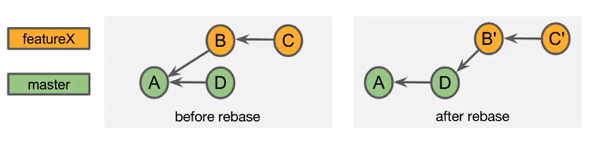

**Diffs**
- Each commit contains a snapshot of the complete project
- Git can calculate the difference between commits
    - This is known as a *diff* or a *patch*

**Rebasing reapplies commits**
When rebasing, Git applies the diffs to the new parent commit
- This is called "reapplying commits"

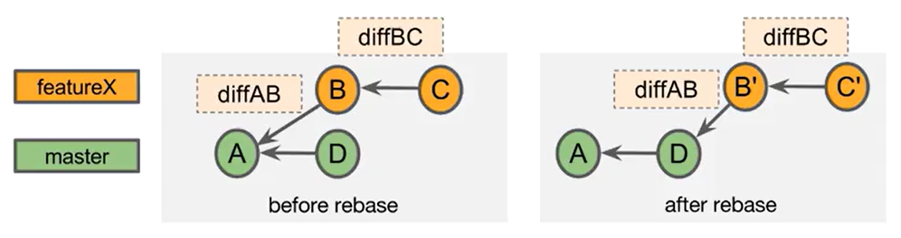

**Rebasing is a Merge**
- Reapplying commits is a form of a merge and is susceptible to merge conflicts
- For example, commits B and C can change the same file, causing a merge conflict during the rebase

**Rebasing PROS and CONS**
- Pros:
    - You can incorporate changes from the parent branch
        - You can use the new features/bugfixes
        - Tests are on more current code
        - It makes the eventual merge into master fast-forwardable
    - Avoids "unnecessary" commits
        - It allows you to shape/define celan commit histories
- Cons:
    - Merge conflicts may need to be resolved
    - It can cause problems if your commits have been shared
    - You are not preserving the commit history

**Executing Rebase**
`git rebase` SYNTAX

`git rebase <upstream>`
- Changes the parent of the currently checked out branch to `<upsteram>`

`git rebase <upstream> <branch>`
- Check out `<branch>` and changes its parent `<upstream>`
- This is a convenience to avoid issuing two commands

```
$ git checkout featureX
$ git rebase master

# equivalent to:
$ git rebase master featureX
```
Upstream usually refers the parent branch of the rebased branch

**Rebasing with merge conflicts**

Fixing a merge conflicts while rebasing
1. **git checkout featureX**
2. **git rebase master**
    a. CONFLICT
3. **git status**
    a. Both modified fileA.txt
4. Fix fileA.txt
5. **git add fileA.txt**
6. **git rebase --continue**

Files with conflicts are modified by Git in the working tree
- Run `git status` to see which files have been modified


**Rebase with a Merge Conflict (1 of 4)**
Since rebase involves a merge, there is the possibility of a merge conflict
```
$ git log --all --graph --oneline
$ git rebase master
$ git status
$ cat fileA.txt
(edit fileA.txt)
$ cat fileA.txt
$ git add fileA.txt
$ git rebase --continue
$ git status
$ git log --all --graph --oneline
```

**Aborting a Rebase**
Use `git rebase --abort` to get back to the pre-rebase state
```
$ git chekot feature
$ git rebase master
$ git rebase --abort
$ git status
```

**Resolving Merge Conflicts - Comparing Merge to Rebase**

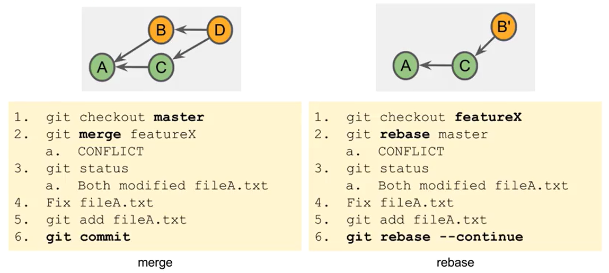

**REVIEW**
- Rebasing moves a branch to the tip of another branch
- Rebasing is a form of merge and may result in merge conflicts


# Rewriting History

**AMENDING a commit**
- You can change the most recent commit
    - change the commit message
    - change the project files
- This creates a new SHA-1 (rewrites history)

```
$ touch fileC.txt
$ git add fileC.txt
$ git commit -m "ad fileC.txt"
$ git log --oneline -1
$ git commit --amend -m "add fileC.txt"
$ git log --oneline -1
```

**Amending a Commit - Changing Commited Files**
- You can modify the staging area and amend a commit
- Optionally use the `--no-edit` option to reuse the previous commit message

```
$ git log --oneline -1
$ echo "some text" > fileC.txt
$ git add fileC.txt
$ git commit --amend --no-edit
$ git log --oneline -1
```

**Interactive Rebase**
- Interactive rebase lets you edit commits using commands
    - The commit can belong to any branch
    - The commit history is changed - do not use for shared commits
- `git rebase -i <after_this_commit>`
    - Commits in the current branch after `<after-this-commit>` are listed in an editor and can be modified

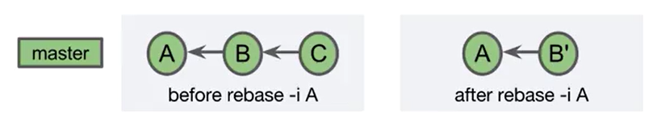


**Interactive Rebase Options**
- Use the commit as is
- Edit the commit message
- Stop and edit the commit
- Drop/delete the commit
- Squash
- Fixup
- Reorder commits
- Execute shell commands

**Edit A Commit**

Example:

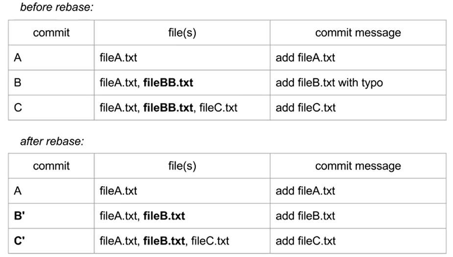

```
$ git log --oneline --graph
$ git rebasae -i 0e91
$ ls
$ mv fileBB.txt fileB.txt
$ git status
$ git add .
$ git commit --amend -m "add fileB.txt"
$ git rebase --continue
$ ls
```

**Delete a Commit**
The commit's work is not used

```
$ git log --oneline --graph
$ ls
$ git rebase -i e091
(command pick)
$ git log --oneline --graph
$ ls
```

**Squash a Commit**
1. Applies a newer (squashed) commit to an older commit
2. Combines the commit messages
3. Removed the newer commit

```
$ git log --oneline --graph
$ ls
$ git rebase -i b7fa
(command squash)
$ git log --oneline --graph
$ ls
```

Note: A fixup is like a squash, but the squashed commit's message is descarded

**Squash VS. Delete**
**Squash** - Combine this commit with the older commit, creating a single commit
    - The work of both commits is included
**Delete** - No changes from this commit are applied
    - The diff is thrown out
    - The work of this commit is lost
    - Greater chance of a merge conflict

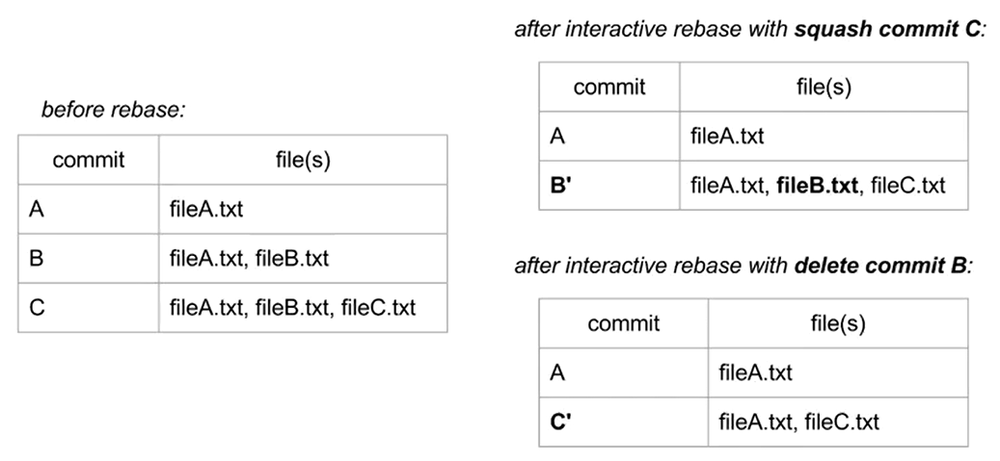

**Squash Merge**
1. Merges the tip of the feature branch (D) onto the tip of the base branch (C)
    - There is chance of a merge conflict
2. Places the result in the staging area
3. The result can then be commited (E)

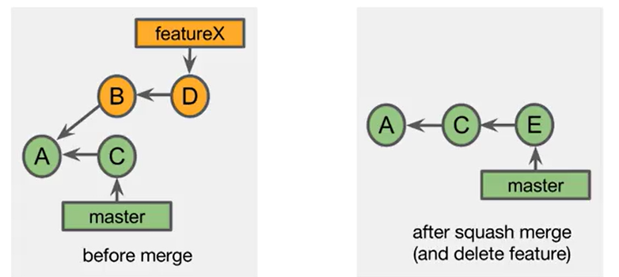

Performing a Squash merge
1. git checkout master
2. git merge --squash featureX
3. git commit
    a. accept or modify the squash message
4. git branch -D featureX

Squash Merge with Fast-Forward
1. git checkout master
2. git merge --squash featureX
3. git commit
    a. accept or modify the squash message
4. git branch -D featureX

**REVIEW**
- You can amend the most recent commit's message and/or committed files
    - It created a new SHA-1
- Interactive rebase allows you to rewrite the history of a branch
- A squash reduces multiple commits into a single commit
