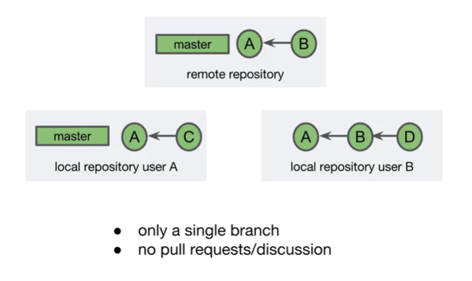
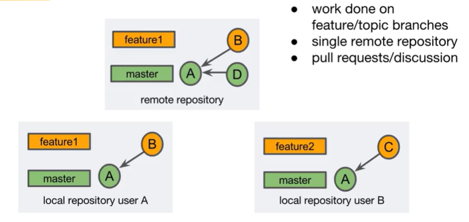
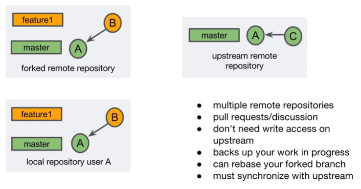
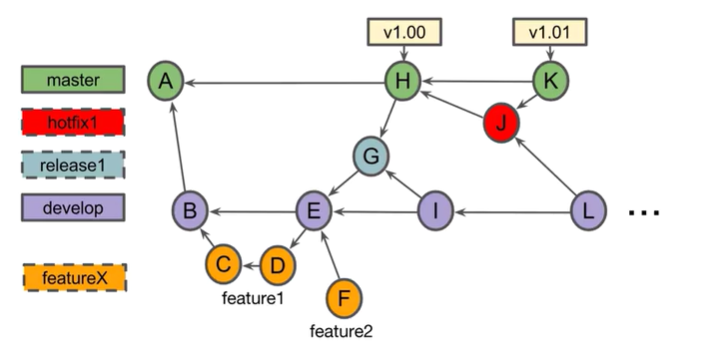

# Pull Requests

- A feature of Git hosting sites
- The ultimate goal is to merge a branch into the project
- Enable team communication related to the work of the branch
    - Notification sent to team members
    - Feedback or comments
    - Approval of the content (code review)

**When Do you Open a Pull Request?**
- When the branch is created
- When you want comments on the branch
- When the branch is ready for review/merging

**Prepering For Pull Request (Single repository)**
- Create a feature branch
- Optionally work on the feature branch
- Push the branch to the remote repository

```
$ git checkout -b "featureX"
$ touch fileA.txt
$ git add fileA.txt
$ git commit -m "added featureX"
$ git push --set-upstream origin featureX
```

Reviewing a Pull Request:
All comments and new commits are visible to the reviewer
Click Approve to add to the count of approvers of the pull request
Click Decline to reject and remove the pull request

Edit a Pull Requset

Merge a Pull Request
Click Merge to begin the process of merging the branch

**Merge Strategy**
- Merge commit - the merge creates a separate commit object (git merge --no-ff)
- Squash - the entire branch is condensed to one linear commit (git merge --squash)

**Deleting Remote Branch Labels**
`git push -d <remote> <branch>`

```
$ git push -d origin featureX
```

**REVIEW**
- Pull request are opened using an online Git host such as Bitbucket or GitHub
- The ultimate goal of a pull request is to merge a branch, but they also facilitate them disxussion and approval
- You can open a pull request any time after creating the branch
- You do not need to edit the pull request if you add a commit to the branch
- You can merge the pull request using an online Git host or by pushing the merge from your local client


## Forking

- Forking - copying a remote repository to your own online account
- Both repositories are remote repositories
- The upstream repository is usually the "source of truth"

**What is a Fork used for?**
- Experiment with/learn from the upstream repository
- Issue pull request to the upstream repository
- Create a different source of truth

**Creating a Fork**
1. In BItbucket, navigate to the repository that you want to fork
2. Click +
3. Select Fork this repository

**Synchronizing a fork**
- Syncing via Bitbucket creates a merge commit on the forked repository
- This commit is not in the upstream repository

**Multi-repository pull request**
1. Fork the upstream repository
2. Create a branch
3. Create a pull request

Merging Multi-Repository pull requests:
Use the Bitbucket interface
or
1. Add the forked repository as a remote
2. Perform and push the merge

**REVIEW**
- A fork is a remote copy of an upstream remote repository
- A fork is created using an online Git hosting provider
- Forks and upstream repositories may become out of sync
- Pull requests can be made from fork and merged into the upstream repository

# Git Workflows

## Centralized workflow



## Feature Branch Workflow



## Forking Workflow



## Gitflow workflow



*master*
1. The initial commit of the project is created on the master branch

*develop*
1. develop branch is created off og the initial commit
2. Commit B is the first commit on develop

*feature X*
1. Create fetaure1 branch off of commit B
2. Begins work and creates commit C
3. Final work on feature 1 is done in commit D
4. Team decides feature 1 is ready
5. Merge commit E is created, adding feature 1 to the project
6. fetaure1 branch label can be deleted

*release1*
1. Team decides commit E is a release candidate
2. Created a relaese1 branch off off commit E (no commits yet)
3. Developer creates feature2 branch and created commit F

*bugFix*
1. The team discovers a bug in commit E
2. Creates commit G on the release1 branch

*v1.00*
1. Commit G is approved
2. Create merge commit H
3. Tag commit H with "v1.00"
4. Create merge commit I on develop to incorporate bug fix from commit G
5. release1 branch label can be removed

*hotfix1*
1. Uh oh, problem with v1.00
2. Create hotfix1 branch
3. Create commit J to fix the issue

*v1.01*
1. Horfix (J) is merged into master (K)
2. Tah v1.01 placed on commit K
3. Hotfix (J) is merged into develop (L)
4. hotfux1 branch label can be deleted


1. Work continues on feture 2 and the next planned version
2. The process continues ...

**GitFlow - Merging "Rules"**
1. Only merge commits on master
2. Commit to master only from a release or hotfix branch
3. If you commit to master, also merge into the develop branch

**REVIEW**
- A centralized workflow involves working on a single branch
- In a feature branch workflow, work of the project is done on feture/topic branches and then merged into longer running branches
- In a forking workflow, work is added upstream using pull requests from the forked repository
- Gitflow workflows enable a continuous train of project releases using multiple types of branches