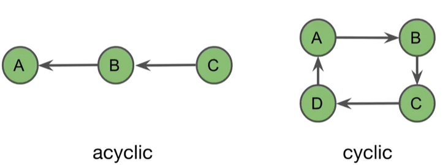
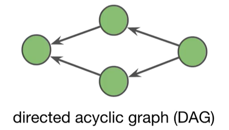
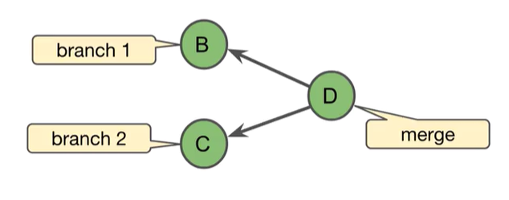
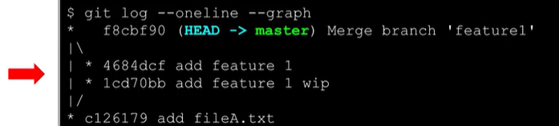
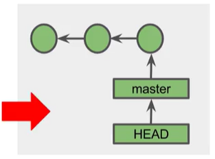
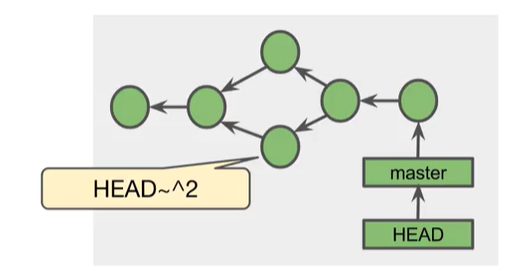
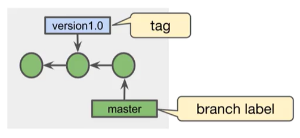

# Git's Graph Model

## Graph
- A way to model connected things
- Contain *nodes* connected by *edges*

**Directed Graph**
- Nodes are connected in a certain direction

**Arrow Direction**
- Direction depends on how you define the relationship

**Acyclic**
- *Acyclic* mean "no cycles" or "non-circular"





**Directed Acyclic Graph (DAG)**
- Contains nodes connected with arrow and has no cycles



## Git's DAG
- Git models the relationship of commits with DAG
- The arrow point at a commit's parent(s)

**Branch**
- Occurs if a commit has more than one child

**Merge**
- A *merge* occurs when a commit has more than one parent




## Viewing Graphs in Git Client




- Git uses a directed acyclic graph (DAG) to represent commit history
- Commits point to their **parent** commit

# Git IDs

## Git Objects
- Commit object - A small text file
- Annotated tag - A reference to a specific commit
- Tree - Directories and filenames in the project
- Blob - The content of a file in the projcet

## Git ID
- The name of a Git object
- 40-character hexademical string
- Also known as *object ID, SHA-1, hash* and *checksum*

## Secure Hash Algorithm 1 (SHA-1)
- Git IDs are *SHA-1 values*
- Unique for a given of content (statistically speaking)

**Creating a SHA-1 For File Contents**
- Use `git hash-object <file>` to create an SH-1 for any content
```
$ echo "hi" > fileA.txt
$ git hash-object fileA.txt
```

## Shortend Git IDs
Four or more characters of the beginning of a Git ID

```
$ git log --oneline
$ git log
$ git show 483d
```

### REVIEW
- Git object names are also known as Git IDs
- Git objects are names with SHA-1 values
- SHA-1 values are unique for a given piece of content (statistically speaking)
- Git IDs are often shortened to the first four or more characters


# Git References

## Reference
User-friendly name that points to:
- a commit SHA-1 hash
- another reference (known as a symbolic reference)

## Using Reference With Git Commands
Use references instead of SHA-1 hashes
```
$ git log
commit 1ef16ac.... (HEAD -> master)
...
$ git show HEAD
```

## Master
*master* is the default name of the main branch in the repository
```
$ git status
on branch master 
...
```

## Branch Label
- Points to the most recent commit in the branch (The "tip of the branch")
- Implemented as a reference

## Viewing Local Branch References In .git/refs/heads
```
$ cd .git
$ cd refs
$ ls
heads tags
$ cd heads
$ ls
master
$ cat master
1ef16...
```

## Head
- A reference to the current commit
- Usually points to the branch label of the current branch
- One HEAD per repository




## Viewing HEAD In the .git Directory
A reference file named `.git/HEAD`

```
$ cd .git
$ cat HEAD
ref: refs/heads/master
```

## Appending Tilde (~) To Git IDs And References
Refers to a prior commit
- ~ or ~1 = parent
- ~2 or ~~ = parent's parent

```
$ git log --outline --graph
$ git show HEAD
$ git show HEAD~ # same as HEAD~1
$ git show master~3
$ git show e0cb6c5~~~
```
- ^^ - first parent's first parent
```
$ git log --oneline --graph
$ git show master^
$ git HEAD^2
fatal: ....
$ git show HEAD^^
```

**Combining ~ and ^**




## Tags
Reference/label attached to a specific commit




**Types of Tags**
Lightweight 
- A simple reference to a commit
Annotated
- A full Git object that references a commit
- Includes tag author information, tag data, tag message, the commit ID
- Optionally can be signed and verified with GNU Privacy Guard (GPG)

## Viewing And Using Tags

- `git tag` - View all tags in the repository

```
$ git tag
v0.1
$ git show v0.1
```

**Creating a Lightweight Tag**
To tag a commit with a lightweignt tag:
- `git tag <tagname> [<commit>]`
- `<commit>` defaults to `HEAD`

```
$ git tag v1.0 # tag the current commit
$ git tag # view tags
v1.0
$ git tag v0.1 HEAD^ # tag the previous commit
$ git tag
v0.1
v1.0
$ git show v0.1
```

**Creating an Annotated Tag**
- `git tag -a [-m <msg> | -F <file>] <tagname> [<commit>]`
- `<commit>` defaults to `HEAD`
- `git show` displays the tag object information followed by the commit information

```
$ git tag -a -m "includes feature 2" v2.0
$ git show v2.0
```

**Tags and Remote Repositories**
- `git push` does not automatically transfer tags to the remote repository
- To transfer a single tag:
`git push <remote> <tagame>`
- To transfer all of your tags
`git push <remote> --tags`

After pushing tags, log into Bitbucket and view them on the remote repository


### REVIEW
- A branch label is a reference that points to the tip of the branch
- HEAD is a reference that points to the current commit
- In Git commands, use ~ and ^ to conveniently refer to previous commits
- Create tags to place label on specific commits
- Tags are not automatically pushed to remote repositories


